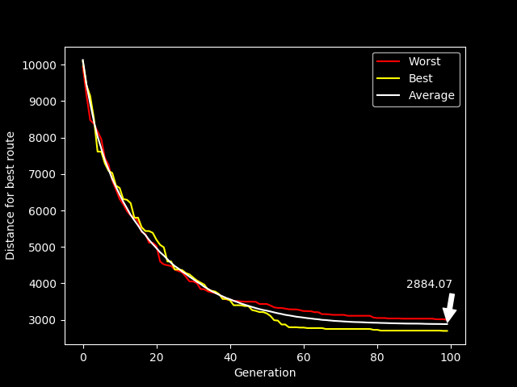

# EC-TSP-UCT
Assignment delivery code for the Evolutionary Computing TSP Assignment (UCT)

Original code by Geoff N., with anti-cheating modifications by Steven T..
Modifications made by me-Karsten.

## Instructions

Repository with my implementation of a Genetic Algorithm with a local heuristic search used to solved the Dynamic Traveling Salesman Problem.
The components consists of tournament parent selection, cross-over, mutation with adaptive step-size, generational
 survival selection and simulated annealing.

 Below is a plot showing the "best", "worst" and average "fitness" of the method over 100 generations performing 100 runs.

The above figure was generated for the Traveling Salesman Problem with a very fast heuristic search on all children in the genetic algorithm. This fast ang give a steady curve for the distance represented in the population. The code now is optimized for the dynamic version of the problem where a more extensive search is done on the fittest child.
